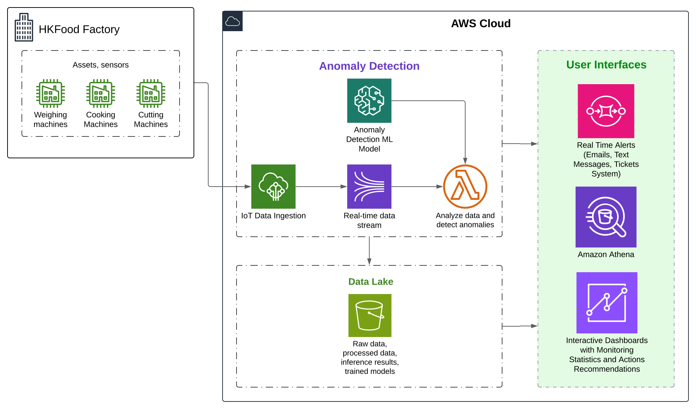

# ZeroCut Solution - README

## Overview

ZeroCut is a smart system developed to help food manufacturers reduce waste and optimize resources. By leveraging real-time data and machine learning, our solution monitors and adjusts the production process, cutting down unnecessary costs and supporting a more sustainable operation.

## Problem

Large food manufacturers, like HKFoods in Finland, lose millions annually due to food waste and inefficient communication. A significant portion of this waste stems from delays in data flow and a reliance on slow, word-of-mouth feedback between teams. ZeroCut addresses this issue with a data-driven approach that streamlines communication and optimizes resource use.

## Solution

ZeroCut provides a real-time monitoring platform that gathers data from factory sensors and uses machine learning algorithms to recommend optimal cut sizes and process adjustments during preprocessing. Our solution is designed with:

- **Real-Time Monitoring**: Captures live data to enable proactive issue identification and resolution.
- **Smart Recommendations**: Machine learning models analyze data to suggest adjustments, minimizing waste.
- **User-Friendly Interface**: A simple, actionable dashboard for workers to manage adjustments easily and supervisors to monitor the production line effectively.
- **Anomaly Alerts**: Delivers real-time alerts for any irregularities, keeping the team in control and enabling quick responses.

## Impact

By implementing ZeroCut, HKFoods can cut food waste by up to 75%, saving approximately €7.5 million annually. Beyond financial savings, ZeroCut fosters a more diverse, efficient, and inclusive work environment by reducing manual feedback and allowing employees to focus on their specific roles.

## Get Started

1. **Contact Us**: Reach out to learn how ZeroCut can be tailored to your needs.
2. **Integration**: We work with your team to implement and integrate the ZeroCut platform with existing processes.
3. **Optimization**: Start reducing waste and improving operational efficiency with real-time insights and machine learning recommendations.

## Call to Action

Ready to revolutionize your food manufacturing process? Contact ZeroCut today to start optimizing your resources and reducing waste, transforming your production for a sustainable future.